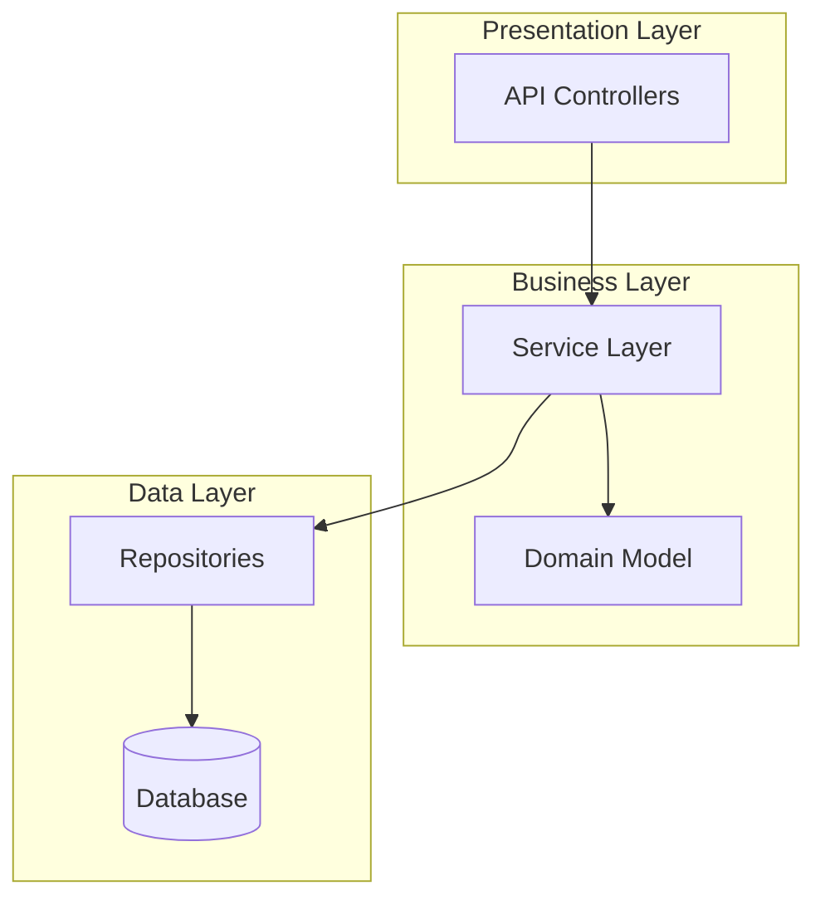
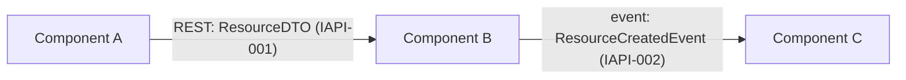
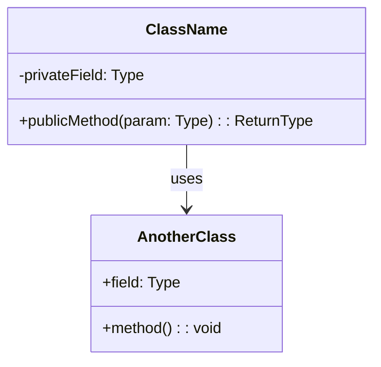
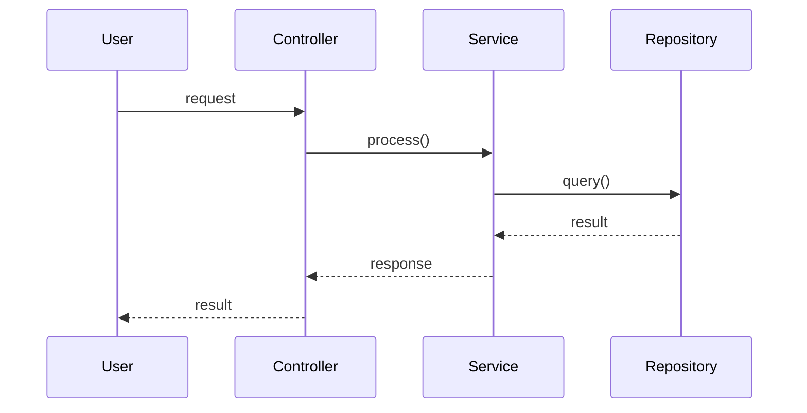
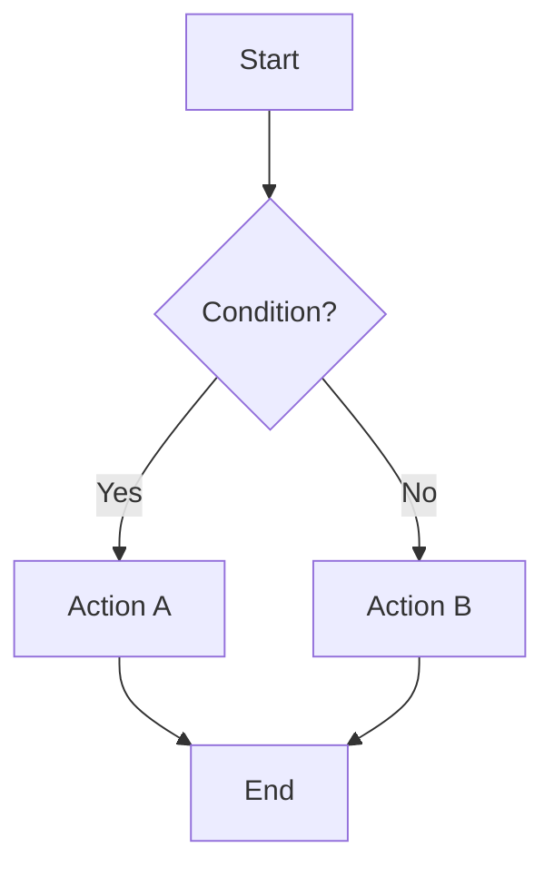
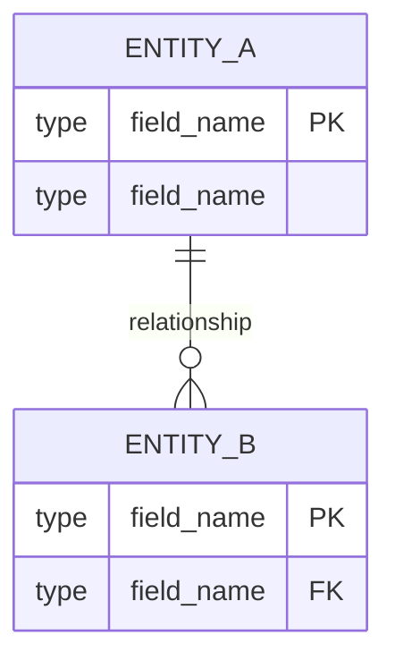
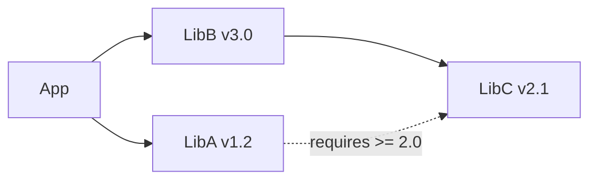

# <Project Name> — 设计文档

**日期**: YYYY-MM-DD
**状态**: 待审批 <!-- 初次落盘为"待审批"；用户审阅门批准后改为"已批准" -->
**SRS 引用**: docs/plans/YYYY-MM-DD-<topic>-srs.md
**输入档位**: L1 / L2 / L3（从 SRS 元数据继承）

<!-- 图表变更跟踪约定 -->
> **图表变更跟踪** -- 仅在增量更新（Wave N > 0）时使用。初始设计文档不使用变更标记。
>
> | 图表类型 | 新增元素 | 修改元素 | 边标记 |
> |---|---|---|---|
> | `graph`/`flowchart` | `Node[Label]:::newNode` | `Node[Label]:::modNode` | `A -->\|"label 🟢"\| B` / `🟡` |
> | `classDiagram` | `<<NEW - Wave N>>` 注解 | `<<MODIFIED - Wave N>>` 注解 | 不适用 |
> | `sequenceDiagram` | `rect rgb(209,250,229)` 包裹 + Note | `rect rgb(254,243,199)` 包裹 + Note | 以 `rect` 包裹 |
> | `erDiagram` | `ENTITY["NEW EntityName"]` 别名 | `ENTITY["MOD EntityName"]` 别名 | 不适用 |
> | `stateDiagram-v2` | `State:::newNode` | `State:::modNode` | 标签使用 `🟢`/`🟡` |
>
> 标准 `classDef` 块（用于 graph/flowchart/stateDiagram-v2）：
> ```
> classDef newNode fill:#d1fae5,stroke:#2ea043,stroke-width:2px
> classDef modNode fill:#fef3c7,stroke:#d4a017,stroke-width:2px
> ```
>
> **图例**: 包含变更标记的每张图表必须在代码围栏前附带一条 Markdown 说明：
> `> **Change Legend (Wave N):** 🟢 = NEW | 🟡 = MODIFIED`
>
> **清理规则**: 在应用新标记之前移除上一波次的变更标记。每张图表仅展示当前波次的标记。

## 0. 项目结构

> 目标项目目录树。将每个条目标记为 **[existing]**、**[new]** 或 **[modified]**，以展示设计对代码库的影响范围。

```
project-root/
├── src/
│   ├── models/              [existing]
│   ├── services/            [new]
│   │   └── auth_service.py  [new]
│   └── api/
│       ├── routes.py        [existing]
│       └── middleware.py     [modified]
├── tests/
│   └── test_auth.py         [new]
└── config.py                [existing]
```

[将上述示例替换为实际项目目录树。仅包含架构上重要的目录和文件 -- 省略生成文件、缓存和 IDE 配置。对于存量项目，聚焦于本设计涉及的区域。]

## 1. 设计驱动因素
[影响本设计的关键 SRS 输入：约束、接口需求]

## 3. 架构

### 3.1 架构概览
[高层系统描述：关键组件、职责及交互]

### 3.2 逻辑视图
[描述系统分解为包/模块/层。展示主要抽象及其关系。]



[将上述示例替换为项目的实际逻辑架构。展示层、包、模块及其依赖方向。]

### 3.3 组件图

[展示主要运行时组件及其交互。
 每条边必须包含：(1) 协议，(2) 引用 §6.2 Contract ID 的 schema 名称。]



[将上述示例替换为实际组件和交互。缺少 Contract ID 标签的边属于设计缺陷 -- 请添加 §6.2 行或说明该边为框架级依赖且无运行时数据交换。]

### 3.4 技术栈决策

> 单一方案（非 A/B/C 候选对比）。每条决策必须含"替代的排除理由"或"唯一可行（附 SRS / ESI 约束编号）"。

| # | 决策维度 | 方案值 | 替代的排除理由 / 唯一可行（附 SRS / ESI 约束编号） |
|---|---------|--------|---------------------------------------------|
| 1 | 语言/运行时 | [如 Python 3.11] | [如 CON-001 指定 Python；Go / Java 被 CON-001 排除] |
| 2 | 主框架 | [如 FastAPI] | [如 IFR-002 要求 REST + 异步 I/O；Django 排除理由：同步模型] |
| 3 | 持久化 | ... | ... |
| 4 | ... | ... | ... |

### 3.5 影响面

> 对存量代码库的影响盘点；纯新增项目可整体标 `[不适用]` 并附一句理由。

| 既有模块 / 文件 | 影响类型（新增/修改/替换/扩展） | 改动量估计（行数 / 复杂度） |
|---------------|---------|-----------|

## 4. 关键功能设计

> **表达形式**：**流程图为主**（mermaid flowchart / sequenceDiagram / classDiagram），**文字与伪代码作为辅助**，聚焦"描述清楚对应设计要素"。可直接引用用户原始需求原文中的参数名 / 文件路径 / 类型范围 / 默认值 / 枚举 —— 1:1 保留禁美化。**不列举"关键决策点"**（本节目标是描述设计要素本身，不是记录过程决策）。
>
> **说明**: 为每个关键功能（或功能组）创建一个子节。每个子节至少必须包含：一张行为图（时序图或流程图）。涉及 ≥2 类协作时补类图；纯规约式增量（L2/L3 输入）可省类图。

### 4.N 功能: <功能名称> (FR-xxx)

#### 4.N.1 概述
[1-2 句话：该功能做什么，满足哪些 SRS 需求]

#### 4.N.2 类图
[展示涉及的类/模块、属性、方法和关系]



#### 4.N.3 时序图
[展示主成功场景下对象/组件之间的交互]



#### 4.N.4 流程图
[展示包含决策点和错误路径的流程/逻辑]



#### 4.N.5 边界与错误路径
[该功能的边界情况、错误处理策略。**描述设计要素本身**，不写"决策过程 / 方案权衡"（那些归 §3.4 技术栈决策）。]

#### 4.N.6 集成面

**提供方**（其他功能依赖本功能）：

| 消费方功能 | Contract ID | 端点/方法 | 响应 Schema |
|---------------------|-------------|-------------------|----------------|
| [#M Feature B] | [IAPI-001] | [`GET /api/resource/:id`] | [`ResourceDTO`] |

**依赖方**（本功能依赖其他功能）：

| 提供方功能 | Contract ID | 端点/方法 | 请求 Schema |
|-----------------|-------------|-------------------|---------------|
| [#K Feature C] | [IAPI-002] | [`POST /api/other`] | [`OtherRequest`] |

[若本功能无跨功能依赖，填写：
 "自包含 -- 无外部集成面。"]

[对每个关键功能或功能组重复第 4.N 节]

## 5. 数据模型

> 若本设计无新增持久化 schema / 关系变更（L2/L3 纯参数配置增量常见），可整体标 `[不适用]` 并附一句理由。

[Schema、关系、存储策略]



## 6. API / 接口设计

### 6.1 外部接口
[面向外部第三方系统的端点、契约、协议]
[追溯至 SRS IFR-xxx 需求]

### 6.2 内部 API 契约

> **硬精确 1:1 复现约束**：SRS §4 FR / §5 IFR 中出现的每个技术标识符（参数名、文件路径、类型范围、默认值、枚举、XML 节点名）必须 1:1 出现在本节契约表 / 子表中。大小写、路径分隔符、范围记号完全一致。**禁"美化"为本地化命名**。
>
> 为 §3.3 中每个组件到组件的交互定义契约。这些契约供功能设计 SubAgent 消费，以确保集成一致性。
>
> **子表按需启用**：纯规约式增量（L2/L3 输入）常以配置 schema 或消息 schema 为主——此时以 §6.2.1 / §6.2.2 表达即可，主契约表（§6.2.3 运行时合约）若无 HTTP/RPC 交互可标 `[不适用]`。

#### 6.2.1 配置文件 schema（按需）

| 文件 | 元素 | 类型 | 范围 | 默认值 | 来源 SRS |
|------|------|------|------|--------|---------|

[若本设计无配置文件改动则省略或标 `[不适用]`]

#### 6.2.2 任务书 / API / 消息 schema（按需）

[XML 节点定义、JSON schema、protobuf、CLI 参数等。每个字段原样保留 SRS 中出现的标识符；若有类型 / 范围 / 枚举约束，原样附注。]

[若本设计无新增消息 / API schema 则省略或标 `[不适用]`]

#### 6.2.3 运行时合约表

| Contract ID | 提供方功能 | 消费方功能 | 端点/方法 | 请求 Schema | 响应 Schema | 错误码 |
|-------------|-----------------|---------------------|-------------------|---------------|----------------|-------------|
| IAPI-001 | #N Feature A | #M Feature B, #K Feature C | `GET /api/resource/:id` | `{ id: UUID }` | `ResourceDTO { ... }` | 401, 404 |

[将上述示例替换为来自 §3.3 边的实际内部契约。若本设计无组件间运行时调用则标 `[不适用]`。]

**Schema 定义**（被上表引用）：

[使用项目的主要语言语法。定义表中使用的每个共享 schema。]

```
// Example — replace with actual schemas
interface ResourceDTO {
  id: string;
  name: string;
  created_at: string; // ISO 8601
}
```

**何时定义内部 API 契约：**
1. §3.3 中由边连接的任意组件对 → 必须有对应行
2. 若功能 A 的 task 对象（`bp-context task`）中 `dependencies[]` 包含功能 B，且 A 在运行时调用 B 的方法/API → 必须有对应行
3. 两个功能共享持久化状态（同一 DB 表/文件/缓存） → 必须定义共享 schema
4. **无需定义**: 纯框架级依赖（如功能 B 依赖功能 A 的项目骨架但无运行时调用）

**粒度规则：** 契约定义需达到消费方可独立编码的程度 -- 即消费方仅通过阅读此表即可编写正确的调用代码和错误处理。

## 7. 第三方依赖

> **说明**: 列出所有第三方库、框架和工具。每个条目必须指定精确版本（或版本范围）和兼容性说明。若本设计不引入 / 不升级任何第三方依赖（L2/L3 纯参数配置增量常见），可整体标 `[不适用]` 并附一句理由。

| 库/框架 | 版本 | 用途 | 许可证 | 兼容性说明 |
|---|---|---|---|---|
| example-lib | 2.3.1 | [用途] | MIT | Compatible with Python >= 3.10 |
| another-lib | ^4.0.0 | [用途] | Apache-2.0 | Requires example-lib >= 2.0 |

### 7.1 版本约束
[记录版本固定的理由、已知不兼容项或升级风险]

### 7.2 依赖关系图
[若依赖关系复杂，展示关键依赖关系]



## 8. 测试策略
[测试类型、覆盖率方法、工具]
[SRS 验收标准如何映射到测试套件]

## 10. 待解决问题 / 风险
[实现过程中需解决的剩余事项]

## 11. 代码库约定与约束

> *本节在设计时从 `docs/rules/` 自动填充（适用于有现有代码库的存量项目）。对于新建项目，保留各子节及空表格 -- 不要将整节标记为"不适用"。下游技能始终读取 §11；空表格表示"无约束"，无需条件逻辑。*
> *除非在本设计文档其他位置明确覆盖，否则这些约定对所有新代码具有约束力。设计覆盖以"⚠ Design Override"注解标记。*

### 11.1 二方库约束

> 替代标准库或第三方替代方案的强制内部库。所有新代码必须使用这些库 -- 不得直接使用被替代的 API。

| 领域 | 内部库 | 替代 | 导入模式 | 备注 |
|--------|-----------------|----------|---------------|-------|
| [如 HTTP Client] | [如 `@company/http`] | [如 axios, fetch] | [如 `import { get } from '@company/http'`] | [如 所有外部 HTTP 调用] |

### 11.4 静态分析工具

> 下游 TDD/质量技能直接运行这些工具 -- 工具读取自身的配置文件。

| 工具 | 配置文件 | 运行命令 |
|------|------------|-------------|
| [如 eslint] | [如 `.eslintrc.json`] | [如 `npx eslint .`] |

### 11.5 编码风格摘要

| 规则 | 约定 | 来源 |
|------|-----------|--------|
| [如 变量命名] | [如 camelCase] | [如 观测到 95% 一致性] |
| [如 缩进] | [如 2 空格] | [如 .editorconfig] |

### 11.6 错误处理模式

[主导错误处理方法：try/catch、Result 类型、自定义 Error 类、集中式中间件等。]

### 11.7 测试与质量工具

> 从 `build-and-compilation.md` 中检测到的测试、覆盖率和变异测试工具。下游 TDD/质量技能从 `{{HARNESS_MEMORY_DIR}}/notes/tool-commands-guide.md`（init 节点产出）获取运行命令。

| 类别 | 工具 | 配置文件 | 运行命令 |
|----------|------|------------|-------------|
| 测试框架 | [如 pytest] | [如 `pyproject.toml [tool.pytest]`] | [如 `pytest`] |
| 覆盖率 | [如 pytest-cov] | [如 `.coveragerc`] | [如 `pytest --cov=src --cov-branch`] |
| 变异测试 | [如 mutmut] | [如 `pyproject.toml [tool.mutmut]`] | [如 `mutmut run`] |
