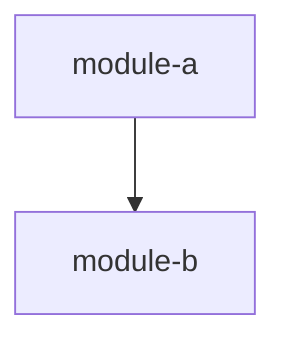
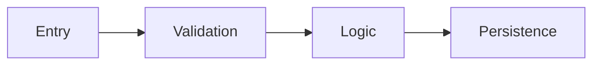
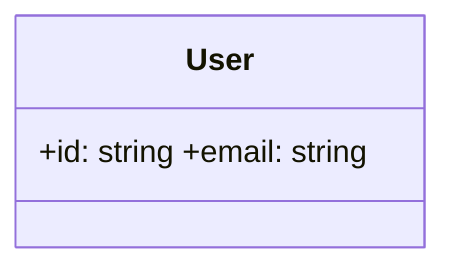

# Codebase Exploration Skill

独立 skill。被 req 直接加载执行，或被 design/wd 通过 SubAgent 加载执行。全部探索阶段由读取者自身顺序完成（不支持嵌套 SubAgent）。

**流程**：项目检测 → Phase 1 结构扫描 → [深度分支] → Phase 2 维度分析 → 综合 → 输出

## 输入参数

从调用方接收：

| 参数 | 取值 | 默认值 |
|------|------|--------|
| Depth | `quick` / `standard` / `deep` | 按 LOC 自检 |
| `--focus` | `architecture` / `dataflow` / `domain` / `api` / `deps` / `health`（逗号分隔） | 全部 6 个维度 |
| `--path` | 相对目录路径 | `.`（项目根目录） |
| User question | 任意描述关注领域的文本 | 无（完整探索） |
| output_path | 探索报告输出路径 | 由调用方指定 |
| rules_dir | 已有规则目录路径 | 由调用方指定 |
| report_template | 报告模板路径 | 由调用方指定 |

## 步骤 1：项目检测与深度自检

1. **语言检测**：按扩展名统计文件数量（`*.py`、`*.js`、`*.ts`、`*.tsx`、`*.java`、`*.go`、`*.rs`、`*.c`、`*.cpp`、`*.rb`、`*.kt`、`*.swift`），排除 `.git/`、`node_modules/`、`venv/`、`.venv/`、`dist/`、`build/`、`__pycache__/`
2. **框架检测**：检查依赖清单（`package.json`、`requirements.txt`、`pyproject.toml`、`pom.xml`、`build.gradle`、`Cargo.toml`、`go.mod`、`Gemfile`、`*.csproj`）
3. **LOC 估算**：采样上限 500 个文件统计代码行数
4. **深度自检**（若未由调用方指定 Depth）：

| 代码行数 | 深度 |
|---------|------|
| < 1,000 | `quick` |
| 1,000 – 10,000 | `standard` |
| > 10,000 | `deep` |

5. **已有规则**：读取 `{rules_dir}`（若存在）作为补充上下文

构建**项目概况**：
```
- root: {--path 值}
- languages: [list with file counts]
- frameworks: [detected from manifests]
- loc_estimate: N
- depth: quick|standard|deep
- focus: [dimensions] or "all"
- user_question: "..." or null
```

## 步骤 2：Phase 1 — 广度优先结构扫描

根据深度收集源文件：

| 深度 | 采样策略 |
|------|---------|
| Quick | 前 30 个最近修改的文件 |
| Standard | 前 60 个：40 个最近 + 20 个来自多样化目录 |
| Deep | 前 120 个 + 所有配置文件（`*.json`、`*.yaml`、`*.yml`、`*.toml`、`*.ini`、`*.xml`、`*.properties`、`*.env*`） |

使用 Glob 发现文件。排除：`.git/`、`node_modules/`、`venv/`、`.venv/`、`dist/`、`build/`、`__pycache__/`、`vendor/`、`target/`。

### 2.1 目录结构映射

列出顶层目录并标注用途猜测：
- `src/`、`lib/`、`app/`、`pkg/` → 源代码
- `test/`、`tests/`、`spec/`、`__tests__/` → 测试
- `docs/`、`doc/` → 文档
- `scripts/`、`tools/`、`bin/` → 工具
- `config/`、`conf/` → 配置
- `migrations/`、`db/` → 数据库
- `public/`、`static/`、`assets/` → 静态文件

### 2.2 模块边界检测

识别代表不同模块/包的目录：
- Python：含 `__init__.py` 的目录
- Node.js：含 `package.json` 或 `index.ts`/`index.js` 的目录
- Go：含 `.go` 文件的目录（每个目录是一个包）
- Java：匹配 `src/main/java/com/...` 包结构的目录
- Rust：含 `mod.rs` 或 `lib.rs` 的目录
- Monorepo：`packages/`、`services/`、`apps/`、`modules/` 中的目录

### 2.3 入口点检测

| 类别 | Grep 模式 |
|------|----------|
| Main function | `if __name__`、`func main()`、`public static void main`、`fn main()`、`int main(` |
| HTTP server | `app.listen`、`http.ListenAndServe`、`@SpringBootApplication`、`uvicorn.run`、`Flask(__name__)` |
| CLI command | `@click.command`、`argparse.ArgumentParser`、`cobra.Command`、`clap::Parser` |
| Worker/Job | `celery.task`、`@Scheduled`、`cron`、`setInterval`、`setTimeout`（服务器上下文） |
| Event handler | `@EventListener`、`on("event"`、`.subscribe(`、`@receiver(signal)` |

### 2.4 API 端点检测

| 框架 | Grep 模式 |
|------|----------|
| Express/Fastify | `app\.(get|post|put|delete|patch)\(`、`router\.(get|post|put|delete|patch)\(` |
| Django | `path\(`、`urlpatterns`、`@api_view` |
| Flask/FastAPI | `@app\.(get|post|route)`、`@router\.(get|post)` |
| Spring | `@(Get|Post|Put|Delete|Request)Mapping` |
| Go HTTP | `HandleFunc\(`、`Handle\(`、`\.GET\(`、`\.POST\(` |
| gRPC | `service\s+\w+\s*\{` in `.proto` |
| GraphQL | `type\s+(Query|Mutation)` |

### 2.5 数据模型检测

| ORM/Schema | Grep 模式 |
|------------|----------|
| SQLAlchemy | `class\s+\w+\(.*Base\)`、`class\s+\w+\(.*db\.Model\)` |
| Django | `class\s+\w+\(.*models\.Model\)` |
| TypeORM/Prisma | `@Entity\(\)`、`model\s+\w+\s*\{` |
| Mongoose | `new\s+Schema\(`、`mongoose\.model\(` |
| Pydantic | `class\s+\w+\(.*BaseModel\)` |
| Protobuf | `message\s+\w+\s*\{` |
| Go struct | `type\s+\w+\s+struct\s*\{` with `gorm` or `json` tags |

### 2.6 配置与集成检测

1. **配置表面**：Grep `os.getenv`、`process.env`、`os.Getenv`、`env::var`、`@Value("${`
2. **外部集成**：Grep HTTP 客户端实例化（`axios`、`requests`、`http.Client`、`fetch`）、数据库连接（`createConnection`、`connect`）、消息队列（`amqp`、`kafka`、`redis`、`SQS`）
3. **测试目录**：Glob `test_*`、`*.test.*`、`*_test.*`、`*.spec.*`

### 汇编 Location Inventory

将发现组装为结构化清单（内部态，供 Phase 2 消费）：

```
### Metrics
| Metric | Value |
|--------|-------|
| Source Files Scanned | N |
| Source Files Total | M |
| Modules Found | N |
| Entry Points Found | N |
| API Endpoints Found | N |
| Data Models Found | N |
| Config Variables Found | N |
| External Integrations Found | N |

### Location Inventory
#### Modules
| Module | Path | Files | Responsibility |
#### Entry Points
| Type | File | Line | Description |
#### API Endpoints
| Method | Path/Name | File | Line |
#### Data Models
| Model | File | Line | Key Fields |
#### Configuration
| Type | Key/File | File | Line |
#### External Integrations
| Service | Type | File | Line |
#### Test Directories
| Directory | Framework | Test Files |
```

## 步骤 3：深度分支

| 深度 | 操作 |
|------|------|
| `quick` | **跳过 Phase 2**。将 Phase 1 Location Inventory 综合成简要概览（≤150 行），跳到步骤 6 输出 |
| `standard` / `deep` | 继续 Phase 2 |

## 步骤 4：Phase 2 — 深度分析

根据 `--focus` 确定分析哪些维度。仅分析 focus 中列出的维度，跳过其余。

### 深度采样数

| 深度 | 要读取的关键文件数 |
|------|-----------------|
| Standard | 最多 20 个 |
| Deep | 最多 40 个 |

优先级：入口点 → 核心领域/服务文件 → 模型 → 路由处理器 → 中间件。

### 维度 1：架构概览（focus 含 `architecture` 时执行）

**分析内容**：

模块分解：对每个模块，读取 1-2 个代表性文件确认职责。

架构模式检测：

| 模式 | 检测信号 |
|------|---------|
| MVC | 目录命名 `models/`、`views/`、`controllers/` |
| 分层 | 明确分为 `presentation/`、`business/`/`service/`、`data/`/`repository/` |
| 六边形/整洁 | `ports/`、`adapters/`、`domain/`、`infrastructure/` |
| 微服务 | 多个独立 `service-*/` 目录，各自有依赖清单 |
| 事件驱动 | 事件总线/发射器、消息队列消费者/生产者、发布-订阅 |
| 单体 | 单一部署单元、共享数据库、无服务边界 |
| 插件式 | 插件注册、钩子系统、扩展点 |

报告主导模式 + 证据。混合模式报告主要 + 次要。

**输出格式**：

```
## Architecture Overview
### Module Decomposition
| Module | Path | Files | Responsibility |

### Architecture Pattern
**Primary**: [pattern] — [evidence]
**Secondary**: [pattern] — [evidence]

### Module Dependency Graph


### Design Patterns Found
| Pattern | Location | Evidence |
```

### 维度 2：入口点与 API 接口（focus 含 `api` 时执行）

**分析内容**：

| 语言 | 入口点检测 |
|------|----------|
| Python | `if __name__ == "__main__"`、`@click.command`、`def main()`、setup.py/pyproject.toml 中的 `entry_points` |
| JS/TS | package.json 的 `"main"`/`"bin"`、Express/Fastify `app.listen()` |
| Java | `public static void main(String[])`、`@SpringBootApplication` |
| Go | `func main()`、`http.ListenAndServe`、Cobra commands |
| Rust | `fn main()`、`#[tokio::main]` |
| C/C++ | `int main()`、`WinMain` |

API 端点：对每个端点，方法、路径/名称、处理器 file:line、认证。

**输出格式**：

```
## Entry Points & API Surface
### Entry Points
| Type | Location | Description |
### API Endpoints
| Method | Path | Handler | Auth |
### Configuration
| Source | Key/File | Location | Description |
```

### 维度 3：数据流与状态管理（focus 含 `dataflow` 时执行）

**分析内容**：

| ORM/框架 | 检测模式 |
|---------|---------|
| SQLAlchemy | `class X(Base)`、`class X(db.Model)` |
| Django ORM | `class X(models.Model)` |
| TypeORM | `@Entity()`、`@Column()` |
| Prisma | `model X { ... }` in schema.prisma |
| Mongoose | `new Schema({...})` |
| GORM | 带 `gorm` 标签的 struct |
| Protobuf | `message X { ... }` in .proto |
| GraphQL | `type X { ... }` in schema |

对每个模型：名称、file:line、关键字段（前 5 个）、关系。
追踪 1-2 个代表性请求路径：入口 → 校验 → 业务逻辑 → 持久化 → 响应。
生成 Mermaid `flowchart LR`。

**输出格式**：

```
## Data Flow & State Management
### Data Models
| Model | File | Key Fields | Relationships |
### Key Data Flow

### State Management
[pattern description]
### External Data Integrations
| Integration | Type | File | Description |
```

### 维度 4：领域模型与业务逻辑（focus 含 `domain` 时执行）

**分析内容**：

核心领域实体（区分实体与值对象）。
业务规则与不变量：强制业务约束的校验逻辑。
业务逻辑热点：领域层中条件逻辑最密集的文件。
关键算法：非平凡算法的名称、file:line、实现方法。

**输出格式**：

```
## Domain Model & Business Logic
### Domain Entities

### Business Rules
| Rule | Location | Description |
### Key Algorithms
| Algorithm | File | Approach |
```

### 维度 5：依赖与集成（focus 含 `deps` 时执行）

**分析内容**：

| 语言 | 依赖清单 |
|------|---------|
| Python | `requirements.txt`、`pyproject.toml`、`setup.py`、`Pipfile` |
| JS/TS | `package.json` |
| Java | `pom.xml`、`build.gradle` |
| Go | `go.mod` |
| Rust | `Cargo.toml` |
| Ruby | `Gemfile` |
| C# | `*.csproj` |

对每个依赖：名称、版本约束、用途分类、运行时/开发依赖。
内部模块耦合：对每个模块统计扇入（被导入次数）和扇出（导入其他模块数）。
外部服务集成：HTTP 客户端、数据库连接、消息队列、云 SDK。
依赖注入模式：DI 容器、手动装配、全局单例。

**输出格式**：

```
## Dependencies & Integrations
### Dependency Summary
| Category | Count | Notable |
### Internal Coupling
| Module | Fan-in | Fan-out | Coupling |
### External Services
| Service | Type | File | Connection |
```

### 维度 6：代码健康度与复杂度（focus 含 `health` 时执行）

**分析内容**：

文件大小分布：测量作用域内所有源文件行数，报告 P50/P90/P99/最大值。
函数/方法长度：启发式统计函数间行数。
复杂度热点：统计每个文件的分支关键词（`if`、`else`、`for`、`while`、`switch`、`case`、`try`、`catch`、`except`、`&&`、`||`、`?:`、`match`），按 100 行归一化。
测试覆盖率全景：每个源码目录的测试文件数、测试与源码比例、零覆盖率目录。
重复信号：跨目录的相似命名文件、重复代码块。
技术债务标记：搜索 `TODO`、`FIXME`、`HACK`、`XXX`、`WORKAROUND`、`TEMP`、`DEPRECATED`。

**输出格式**：

```
## Code Health
### File Size Distribution
| Percentile | Lines |
### Complexity Hotspots
| File | Branches | Lines | Density |
### Test Landscape
| Directory | Source Files | Test Files | Ratio |
### Technical Debt Markers
| Keyword | Count | Top Locations |
```

## 步骤 5：综合

合并 Phase 1 + Phase 2 发现：

1. **去重**：多个维度提到相同文件/模块时合并处理
2. **交叉引用**：将架构发现与健康热点关联（例如"模块 X 既是最复杂的，也是耦合度最高的"）
3. **构建关键发现摘要**：
   - 语言（来自项目概况）
   - 架构模式（来自维度 1）
   - 入口点数量 / API 端点数量 / 领域实体数量（来自各维度）
   - 外部集成数量
   - 复杂度热点前 3 名
   - 测试与源码比例
   - 技术债务标记数量
4. **沉淀 Open Questions**：3-8 条最高价值问题，每条含问题 + 关联 `file:line` + 下游影响 phase（`requirements` / `design` / `increment`）

## 步骤 6：输出

1. 使用 `{report_template}` 作为输出结构模板
2. 写入 `{output_path}`
3. 替换模板中的占位符为综合发现
4. 行数预算：quick ≤150 行、standard ≤400 行、deep ≤600 行
5. Focus 过滤：仅包含请求的维度章节；始终包含关键发现摘要和代码引用索引
6. 重新运行行为：已存在则覆盖（幂等）

## 各深度行为汇总

| 方面 | Quick | Standard | Deep |
|------|-------|----------|------|
| Phase | 仅 Phase 1 | Phase 1 + 2 | Phase 1 + 2 |
| 采样文件数 | 前 30 | 前 60 | 前 120 + 全部配置 |
| Mermaid 图 | 0 | 2-3 | 所有适用的 |
| 证据引用 | 每类前 3 | 每类前 5 | 详尽 |
| 输出预算 | 150 行 | 400 行 | 600 行 |

## 规则

- **只读**：不修改任何源文件、配置或 git 状态
- **基于证据**：每个结构性断言需要 `file:line` 示例
- **不作评判**：按原样记录模式，即使不一致或过时
- **输出预算**：遵循各深度的行数限制
- **流水线隔离**：绝不读写流水线工件（SRS、设计文档、task state）；`{rules_dir}` 只读作为补充上下文
- **幂等性**：重新运行总是生成干净的全新报告
- **效率**：使用 Glob 进行文件发现、Grep 进行模式匹配、Read 进行文件检查、Bash 仅用于 git/wc/find 命令
