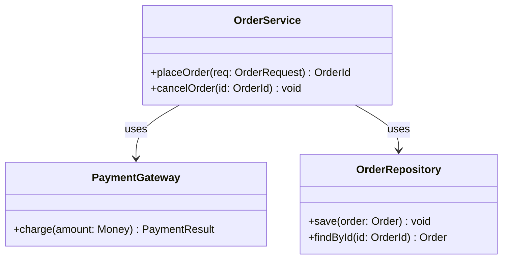
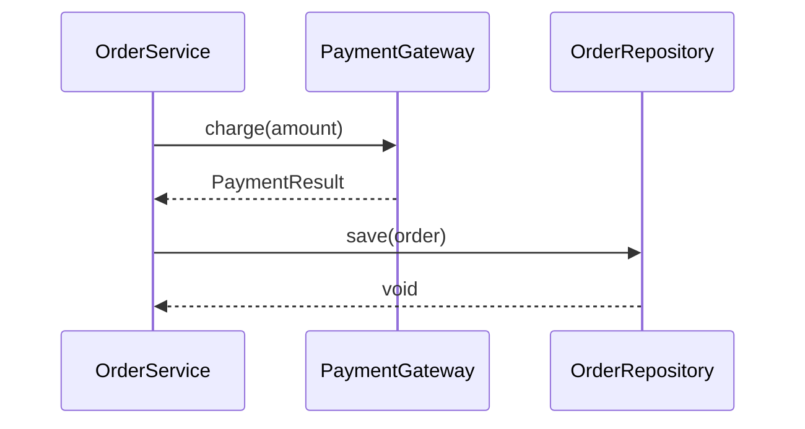
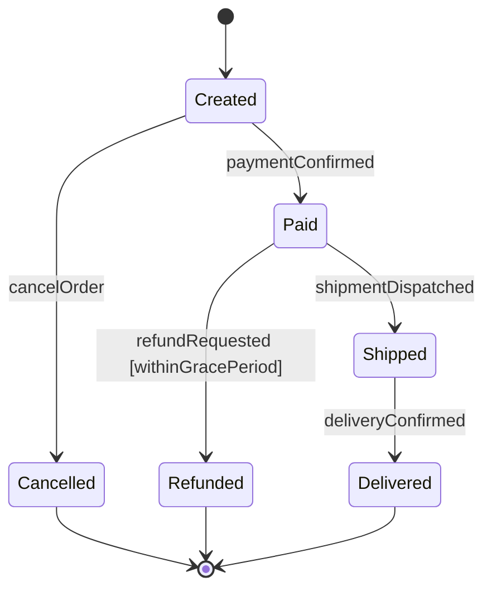
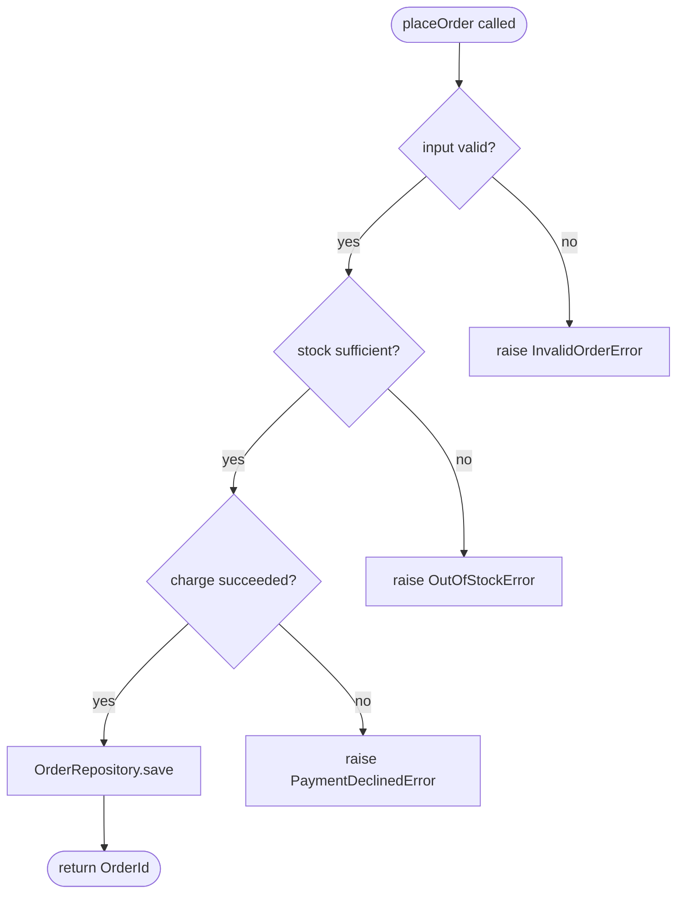

# 功能详细设计：[功能标题]（功能 #ID）

**日期**：YYYY-MM-DD
**功能**：#ID -- [标题]
**优先级**：high/medium/low
**依赖**：[列表或 "none"]
**设计参考**：docs/plans/YYYY-MM-DD-<topic>-design.md § 4.N
**SRS 参考**：FR-xxx

## 项目结构

> 本功能涉及的文件和目录。标记为 **[existing]**、**[new]** 或 **[modified]**。

```
src/
├── services/
│   └── auth_service.py      [new]
└── api/
    └── middleware.py         [modified]
tests/
└── test_auth.py             [new]
```

[替换为本功能的实际路径。仅显示本功能创建或修改的文件。]

## 设计对齐

> **UML 嵌入粒度**：本章节聚焦**方法内**协作/调用序列（系统设计 §4.N 已覆盖类/模块层，粒度不重叠）。若内容与 §4.N 等价，仅写一行引用（如"见系统设计 §4.3 类图"），不重复画图。

**类图**（触发：本功能涉及 ≥2 个类/模块协作）。节点/方法/字段必须使用真实标识符；仅类图允许用 classDef 色标区分 NEW/MODIFIED/EXISTING：



**时序图**（触发：≥2 个对象/服务的调用顺序）。参与者/消息必须使用真实名称；**禁止**色彩、图标、rect 框、`note over` 装饰：



**辅助说明**：图为主，文字只注解图中非显然的决策（如"选择 charge 早于 save 以避免订单持久化后支付失败产生脏数据"）。不重复图中已明示的调用顺序。

**偏差**：[无，或解释偏差并附用户批准说明]

## 现有代码复用

> 通过代码库探索和已通过依赖功能发现的代码，本功能应复用、扩展或作为模式参考。最大化复用 -- 优先导入现有代码而非编写新代码。

| # | 类别 | 源文件 | 名称 | 签名/模式 | 动作 | 理由 |
|---|------|--------|------|-----------|------|------|
| 1 | [工具函数 / API 客户端 / 数据访问 / 错误辅助 / 库模式] | [文件路径] | [函数/类名] | [签名或导入模式] | [REUSE / EXTEND / PATTERN] | [为什么与当前功能相关] |

**§11.1 库使用示例**（来自已通过功能的具体使用）：

| §11.1 库 | 现有使用文件 | 导入语句 | 调用模式 |
|-----------|--------------|----------|----------|
| [库名] | [file:line] | [导入语句] | [实际调用方式] |

**需求相关现有行为**（来自代码库行为发现）：

| # | SRS 标准 | 现有行为 | 源文件 | 重叠度 | 设计影响 |
|---|----------|----------|--------|--------|----------|
| 1 | [来自 srs_trace 的 AC] | [这段代码的功能] | [file:line] | [完全/部分/相邻] | [复用/扩展/模式 -- 具体建议] |

**§11 库 & 复用映射**

| 方法 | 操作 | 必需库/复用项 | 导入模式 | 替代 |
|------|------|---------------|----------|------|
| [method] | [e.g., HTTP GET to external API] | [e.g., @company/http (§11.1)] | [e.g., `from company.http import get`] | [e.g., requests.get] |

## SRS 需求

[从 SRS 复制完整的 FR-xxx 章节 -- EARS 声明、验收标准、Given/When/Then 场景]

## 接口契约

| 方法 | 签名 | 前置条件 | 后置条件 | 异常 |
|------|------|----------|----------|------|
| `method_name` | `method_name(param: Type, ...) -> ReturnType` | [调用前必须为真的条件] | [调用后保证的条件] | [异常 + 条件] |

**设计理由**（每个非显而易见的决策一行）：
- [例如，为什么阈值默认为 0.6，为什么参数 X 是可选的]
- **跨功能契约对齐**：如果本功能在设计 §6.2 中作为 Provider 或 Consumer，对应方法的签名必须匹配 §6.2 schema。记录契约 ID（例如 IAPI-001）以便追踪。

**状态机**（触发：方法含状态依赖，状态数 ≥2 且有 transition）。嵌入在对应方法说明之后。状态名、事件名必须使用真实标识符；**禁止**色彩、图标、rect 框、皮肤主题：



**辅助说明**（可选）：文字仅注解守卫条件含义（如 `withinGracePeriod` 定义为"支付后 24 小时内"）。状态转移本身由图表达，不重复列出。

**边界决策**

| 参数 | 最小值 | 最大值 | 空/Null | 边界行为 |
|------|--------|--------|---------|----------|
| [param] | [val] | [val] | [行为] | [行为] |

**错误处理**

| 条件 | 检测方式 | 响应 | 恢复 |
|------|----------|------|------|
| [条件] | [如何检测] | [异常或默认值] | [调用方操作] |

## 实现摘要

> 从系统设计 §4.N 派生的变更增量。Red/Green/Refactor 必须严格遵从。

| 文件 | 类/模块 | 动作 | 变更描述 | 关键设计决策 |
|------|---------|------|----------|--------------|
| [path] | [ClassName] | [NEW/MODIFY] | [方法级：添加/修改什么方法、关键逻辑要点] | [非显而易见的决策理由] |

**流程图**（触发：任一行的"关键设计决策"涉及 ≥3 个决策分支或异常路径）。嵌入在上表对应行之后。节点文本必须使用真实方法名 / 真实判定条件；**禁止**色彩、图标、rect 框、classDef：



**辅助说明**（可选）：文字仅补充图外上下文（如"InvalidOrderError 汇总 §11.6 错误处理模式"）。分支条件与错误终点由图承载，不再散文重述。

## 全局约束摘录

> 必有章节。TDD Red / Green / Refactor **仅读 feature.md**、不回访 Design §11 — 本章节是 §11.1 / §11.5 / §11.6 合规检查的唯一权威源。

### §11.1 强制内部库（仅本特性涉及的领域）

| 领域 | 强制库 | 被替代方案 | 导入模式 |
|------|--------|------------|----------|
| [domain hit by this feature] | [lib] | [forbidden alt] | [import statement] |

[若本特性不触及 §11.1 任一领域 → 写 "本特性未触及 §11.1 任一领域。"；若 Design §11.1 为空 → 写 "N/A — design §11.1 empty"]

### §11.5 命名约定（全表）

[一字不差摘自 Design §11.5 全表；若为空 → "N/A — design §11.5 empty"]

### §11.6 错误处理模式

[一字不差摘自 Design §11.6 全段；若为空 → "N/A — design §11.6 empty"]

> 摘自 Design §11.1 / §11.5 / §11.6 — commit <short-sha>，date YYYY-MM-DD

## 静态分析与质量工具命令

> 必有章节。TDD Refactor 静态分析门禁直接运行本表命令；不回访 Design §11.4。

### §11.4 静态分析命令

| 工具 | 命令 | 适用范围 |
|------|------|----------|
| [tool] | `[exact command string]` | [scope, e.g. src/**] |

[若 Design §11.4 为空 → 写 "N/A — Design §11.4 为空，无静态分析门禁。"]

### §11.7 覆盖率与变异阈值

| 指标 | 阈值 | 来源 |
|------|------|------|
| Line coverage | ≥ N% | Design §11.7 |
| Branch coverage | ≥ N% | Design §11.7 |
| Mutation kill rate | ≥ N% | Design §11.7（如有） |

[若 Design §11.7 为空 → 写 "N/A — Design §11.7 未指定阈值。"]

> 摘自 Design §11.4 / §11.7 — commit <short-sha>，date YYYY-MM-DD

## 测试清单

| ID | 类别 | 追踪到 | 输入/设置 | 预期 | WRONG_IMPL（杀死哪个错误实现？）|
|----|------|--------|-----------|------|-------------------------------|
| 1  | FUNC/happy       | BDD-001（FR-xxx AC-1）| [场景 given/examples] | [场景 then] | [返回硬编码值；交换两字段；跳过计算] |
| 2  | FUNC/error       | BDD-002 §接口契约 Raises | [触发条件] | [异常类型 + 消息] | [静默吞掉异常；抛错误类型] |
| 3  | BNDRY/range      | §接口契约 边界决策 | [边界值] | [精确行为] | [差一错误；含/不含边界混淆] |
| 4  | BNDRY/existence  | §接口契约 边界决策 | [空/缺失/null] | [精确行为] | [NPE；把空当正常值处理] |
| 5  | BNDRY/time       | §接口契约 时序约束 | [并发/超时/顺序] | [精确行为] | [竞态未处理；超时未触发] |
| 6  | FUNC/logic       | §实现摘要 | [前置条件 + 输入] | [预期结果] | [缺失分支] |
| 7  | INTG/db          | §接口契约 + 外部依赖 | [真实 DB 设置] | [数据持久化 + 可查询] | [连接未建立/错误表] |
| 8  | INTG/api         | §4.N 跨服务调用 | [真实 HTTP 端点] | [正确响应 schema] | [错误端点/超时未处理] |

类别格式：`MAIN/subtag`。MAIN ∈ `{FUNC, BNDRY, SEC, PERF, INTG}`。
- `MAIN=BNDRY` 时 subtag 必取 `{range, existence, time}`（对齐 iron-law R1 CORRECT 最小子集）；`conformance, ordering, reference, cardinality` 为推荐子集
- 其余 MAIN 的 subtag 为自由标签

> **「追踪到」列**：源自 BDD 行为的行写其 `BDD-xxx` id（必要时并列 FR-AC / 设计章节，如 `BDD-001（FR-002 AC-1）`）；源自设计内部的行（§4.N 接口、UML 分支、集成边界）写设计章节。**bdd.json 中每个相关场景至少对应一行带其 BDD-xxx**——这是 TDD Red 打标与 gate_red 机检的追溯锚点。

> ID 为排序序号，不作为测试函数名前缀。测试函数名从类别+输入列派生描述性名称（如 FUNC/error + "空字符串" → `test_validate_rejects_empty_string`）。
>
> **WRONG_IMPL 列**直接供 TDD Red SubAgent 作为测试函数 `# WRONG_IMPL:` 注释内容（iron-law R4）。设计阶段已预分析 → TDD 阶段直接引用，不再二次推导。

## 验证检查清单
- [ ] 所有 SRS 验收标准（来自 srs_trace）追踪到接口契约后置条件
- [ ] 所有 SRS 验收标准（来自 srs_trace）追踪到测试清单行
- [ ] 每个相关 BDD 场景（bdd.json 中 fr[] ∩ task.srs_trace 的 feature 下 scenario）在测试清单"追踪到"列被至少一行以 BDD-xxx 引用
- [ ] 边界决策表覆盖所有接口契约参数
- [ ] 错误处理表覆盖所有 Raises 条目
- [ ] 实现摘要覆盖项目结构中所有 [new]/[modified] 文件
- [ ] 测试清单负向测试比例 >= 40%
- [ ] §4.N 中命名的所有函数/方法至少有一个测试清单行
- [ ] 所有方法/类/参数名符合 §11.5 命名约定
- [ ] §11.1 强制库覆盖的所有操作使用这些库（接口契约中无被替代的方案）
- [ ] 现有代码复用章节记录了来自代码库探索和已通过依赖的所有可发现的可复用代码
- [ ] 需求相关行为扫描完成 -- 重叠的现有行为已记录或明确标注为不存在
- [ ] UML 图（若存在）节点/参与者/状态/消息均使用真实标识符，无 A/B/C 等代称
- [ ] 非类图的 UML（sequence / state / flowchart）不含色彩、图标、rect 框、classDef 等装饰元素
- [ ] 每个 UML 图元素（类节点 / sequence 消息 / state transition / flow 决策分支）在测试清单"追踪到"列被至少一行引用
- [ ] §全局约束摘录 存在且三子节（§11.1 子集 / §11.5 全表 / §11.6 全段）齐全（空时有显式 N/A 标注）；末尾有溯源行
- [ ] §静态分析与质量工具命令 存在且两子节（§11.4 / §11.7）齐全（空时有显式 N/A 标注）；末尾有溯源行

## 澄清附录

> 无需澄清 -- 所有规格均无歧义。

| # | 类别 | 原始歧义 | 决议 | 权威 |
|---|------|----------|------|------|
| — | — | — | — | user-approved / assumed |

<!-- 本章节在以下情况由 SubAgent 填充：
     1. 低影响歧义被假设（Authority = "assumed"）
     2. 用户批准的决议通过重新分派提供（Authority = "user-approved"）
     Feature-ST 读取本章节以避免重复询问已解决的问题。 -->
